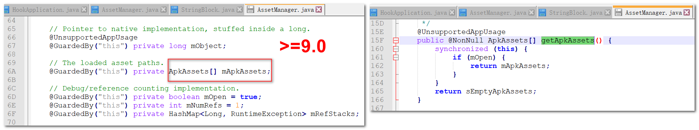
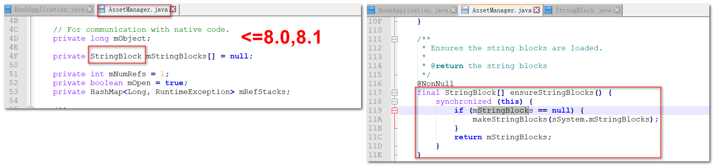

# AndPluginHookTalk
Hook  in Plugin Project

### hook按钮的点击监听

### 使用hook来启动一个没有在manifest注册的Activity

startActivity ---> AMS检测当前要启动的Activity是否已经在Manifest注册--->没注册就抛异常`this activity in your AndroidManifest.xml?`

目标： 通过hook把目标Activity换成一个已经被注册的Activity去检测，检测完成再启动原本的目标Activity
      使得DstNoManifestActivity不在AndroidManifest里面注册，也能启动

具体过程：

1.替换（把系统里面的替换成动态代理)
2.添加动态代理（做替换工作)

1.把DstNoManifestActivity替换我们真实有效的ProxyActivity
startActivity(DstNoManifestActivity) --->  
     Activity --> Instrumentation.execStartActivity  
     ---> ActivityManagerNative.getDefaultIActivityManager.startActivity  
       --->(Hook) AMS.startActivity(检测，当前要启动的Activity是否注册了)

思想切入点:既然会得到IActivityManager，会设置IActivityManager，(寻找替换点(动态代理))

2.ASM检查过后，要把这个ProxyActivity换回来--> DstNoManifestActivity
startActivity -- DstNoManifestActivity -- (Hook ProxyActivity)（ANS）检测，当前要启动的Activity是否注册了) ok ---》>ActivityThread(即将加载启动Activity) ----(要把这个ProxyActivity 换回回DstNoManifestActivity)
Hook LAUNCH_ACTIVITY
要在Handler，handleMessage 之前执行


### 类加载和hook插件

宿主直接跳转插件里面的Activity会报错：
```
Caused by: java.lang.ClassNotFoundException: Didn't find class "com.netease.plugin_package.PluginActivity" on path:
 DexPathList[[zip file "/data/app/com.netease.hookproject-1/base.apk", zip file "/data/app/com.netease.hookproject-1/split_lib_
 dependencies_apk.apk", zip file "/data/app/com.netease.hookproject-1/split_lib_slice_0_apk.apk", zip file "/data/app/com
 .netease.hookproject-1/split_lib_slice_1_apk.apk", zip file "/data/app/com.netease.hookproject-1/split_lib_slice_2_apk.apk"
 , zip file "/data/app/com.netease.hookproject-1/split_lib_slice_3_apk.apk", zip file "/data/app/com.netease.hookproject-1/s
 plit_lib_slice_4_apk.apk", zip file "/data/app/com.netease.hookproject-1/split_lib_slice_5_apk.apk", zip file "/data/app/com
 .netease.hookproject-1/split_lib_slice_6_apk.apk", zip file "/data/app/com.netease.hookproject-1/split_lib_slice_7_apk.apk",
 zip file "/data/app/com.netease.hookproject-1/split_lib_slice_8_apk.apk", zip file "/data/app/com.netease.hookproject-1/spli
 t_lib_slice_9_apk.apk"],nativeLibraryDirectories=[/vendor/lib, /system/lib]]
```

Activity启动：

    > Activity --> Instrumentation ---> AMS检查 --->
    ActivityThread (即将加载)-（handleLaunchActivity 类加载Activity performLaunchActivity ---> newActivity(cl == PathClassLoader)）

PathClassLoader.loadClass  ---》 BaseDexClassLoader --》ClassLoader.loadClass--findClass(空方法) 让覆盖的子类方法去完成 --》
BaseDexClassLoader.findClass() ---》pathList.findClass

类加载过程：
    1). BaseDexClassLoader.findClass() -- c 为什么为null，--》 DexPathList.findClass(className) ---》DexFile.loadClassBinaryName

    2). for遍历 dexElements == Element[] ，分析 Element 是什么 ，为什么Element.dexFile==null?

Android虚拟机加载dex文件，Element是对Dex表现形式的描述

  * 为什么 Element ==null?
    就是因为类加载机制加载的是宿主的 classes.dex,Elements也是宿主的， 没有插件的Element。

解决方案：把插件的dexElements 和 宿主中的 dexElements 融为一体  PathClassLoader 就能加载到 插件/宿主  都可以加载到了


   * -- Android ClassLoader介绍
       * 1.java中的ClassLoader 和 Android的ClassLoader 不一样
       * 2.Android中的ClassLoader 分为两类：
            * 系统提供的ClassLoader --> BootClassLoader，PathClassLoader，DexClassLoader
            * 自定义ClassLoader

       * 补充：
          BootClassLoader: 给系统预加载使用的
          PathClassLoader: 给程序/系统程序/应用程序 加载class的 PathClassLoader
          DexClassLoader: 加载 apk zip apk文件 DexClassLoader

          **App启动**：
            1.内核启动 ...
            2.init第一个进程
            3.zygote进程
                ---> zygoteInit --> BootClassLoader.getInstance();  
                 handleSystemServerProcess PathClassLoaderFactory --》PathClassLoader
            4.zygote进程孵化 SystemServer
            5.SystemServer启动很多的服务 ---（AMS，PSM，...）




